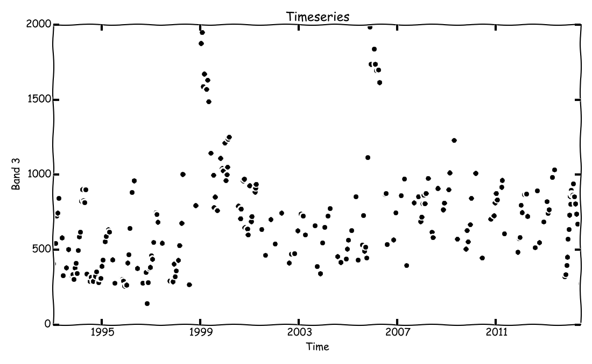
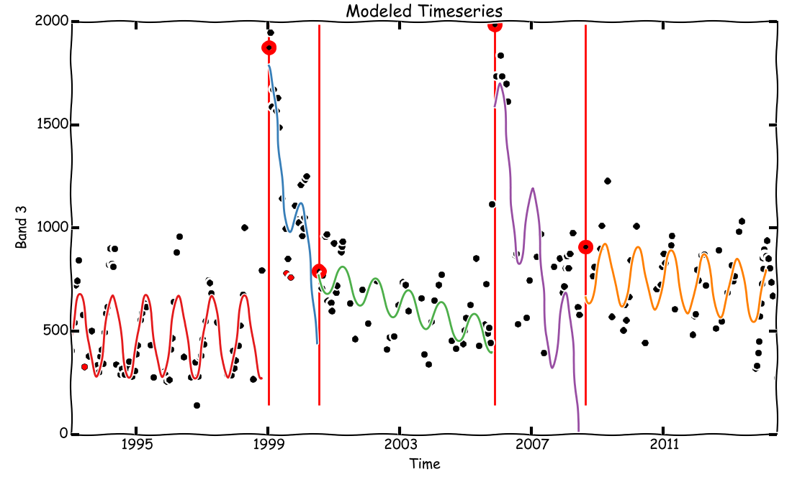

# Yet Another Timeseries Model (YATSM)

[](https://travis-ci.org/ceholden/yatsm) [](https://coveralls.io/github/ceholden/yatsm?branch=master) [](http://dx.doi.org/10.5281/zenodo.17129) [](https://gitter.im/ceholden/yatsm?utm_source=badge&utm_medium=badge&utm_campaign=pr-badge&utm_content=body_badge)

## About
Yet Another Timeseries Model (YATSM) is a Python package for utilizing a collection of timeseries algorithms and methods designed to monitor the land surface using remotely sensed imagery.

The ["Yet Another..."](http://en.wikipedia.org/wiki/Yet_another) part of the package name is a reference to the algorithms implemented:

* Continuous Change Detection and Classification (CCDC)
    - Citation: Zhu and Woodcock, 2014; Zhu, Woodcock, Holden, and Yang 2015
    - Note: Unvalidated, non-reference implementation
* Long term mean phenology fitting using Landsat data
    - Citation: Melaas, Friedl, and Zhu 2013
    - Note: validated against Melaas *et al*'s code, but not a reference implementation
* Commission detection via *p*-of-*F* (e.g., Chow test) test similar to what is used in LandTrendr (Kennedy, *et al*, 2010)
* ...
* More to come! Please reach out if you would like to help contribute

Note that the algorithms implemented within YATSM are not to be considered "reference" implementations unless otherwise noted.

The objective of making many methods of analyzing remote sensing timeseries available in one package is to leverage the strengths of multiple methods to overcome the weaknesses in any one approach. The opening of the Landsat archive in 2008 made timeseries analysis of Landsat data finally possible and kickstarted a "big bang" of methods that have evolved and proliferated since then. Over the years, it has become obvious that each individual algorithm is designed to monitor slightly different processes or leverages different aspects of the same datasets. Recent comparative analysis studies (Healey, Cohen, *et al*, forthcoming) strongly suggest that an ensemble of such algorithms is more accurate and informative than any one result alone. A suite of weak learners combined intelligently does indeed create a more powerful ensemble learner. By using a common set of vocabulary and making these algorithms available in one place, the YATSM package hopes to make such an ensemble possible.

Please consider citing as:

    Christopher E. Holden. (2015). Yet Another Time Series Model (YATSM). Zenodo. 10.5281/zenodo.17129

## Example
The simplest way of using YATSM would be the pixel-by-pixel command line interface - `run_yatsm.py`.

We'll use the example [Landsat stack from Chiapas, Mexico](https://github.com/ceholden/landsat_stack) in combination with the "CCDCesque" Python implementation of the Continuous Change Detection and Classification (Zhu and Woodcock, 2014; Zhu, Woodcock, Holden, and Yang 2015) for this demonstration:

``` bash
    > yatsm pixel --band 3 --style xkcd examples/p022r049/p022r049.yaml 133 106
```

Produces:
    
    

For further visualization of timeseries of remotely sensed images, I encourage you to try the ["TSTools" QGIS plugin](https://github.com/ceholden/TSTools) which allows users to easily and rapidly explore both the time and space dimensions of such datasets. Timeseries "drivers", or methods of linking data and algorithms with the plugin, are available for the reference CCDC implementation and the YATSM "CCDCesque" implementation, as well as for the combined visualization of Landsat data with radar and meteorological data timeseries.

## Documentation

Documentation is available [here](http://ceholden.github.io/yatsm/).

Contributions to the documentation, especially for the user guide, is more than welcomed. The documentation for this project is built using [Sphinx](http://sphinx-doc.org/) using the [ReadTheDocs](https://readthedocs.org/) theme. See the `docs/` folder for documentation source material.

## Installation

It is strongly encouraged that you install YATSM into an isolated environment, either using [`virtualenv`](https://virtualenv.pypa.io/en/latest/) for `pip` installs or a separate environment using [`conda`](http://conda.pydata.org/docs/), to avoid dependency conflicts with other software.

This package requires an installation of [`GDAL`](http://gdal.org/), including the Python bindings. Note that [`GDAL`](http://gdal.org/) version 2.0 is not yet tested (it probably works, but I haven't tried GDAL 2.x), but recent 1.x versions (likely 1.8+) should work. [`GDAL`](http://gdal.org/) is not installable solely via `pip` and needs to be installed prior to following the `pip` instructions. If you follow the instructions for [`conda`](http://conda.pydata.org/docs/), you will not need to install `GDAL` on your own because [`conda`](http://conda.pydata.org/docs/) packages a compiled copy of the `GDAL` library (yet another reason to use [`conda`](http://conda.pydata.org/docs/)!).

### pip
The basic dependencies for YATSM are included in the `requirements.txt` file which is  by PIP as follows:

``` bash
    pip install -r requirements.txt
```

Additional dependencies are required for some timeseries analysis algorithms or for accelerating the computation in YATSM. These requirements are separate from the common base installation requirements so that YATSM may be more modular:

* Long term mean phenological calculations from Melaas *et al.*, 2013
    * Requires the R statistical software environment and the `rpy2` Python to R interface
    * `pip install -r requirements/pheno.txt`
* Computation acceleration
    * GLMNET Fortran wrapper for accelerating Elastic Net or Lasso regularized regression
    * Numba for speeding up computation through just in time compilation (JIT)
    * `pip install -r requirements/accel.txt`

A complete installation of YATSM, including acceleration dependencies and additional timeseries analysis dependencies, may be installed using the `requirements/all.txt` file:

``` bash
    pip install -r requirements/all.txt
```

### Conda
Requirements for YATSM may also be installed using [`conda`](http://conda.pydata.org/docs/), Python's cross-platform and platform agnostic binary package manager from [ContinuumIO](http://continuum.io/). [`conda`](http://conda.pydata.org/docs/) makes installation of Python packages, especially scientific packages, a breeze because it includes compiled library dependencies that remove the need for a compiler or pre-installed libraries.

Installation instructions for `conda` are available on their docs site [conda.pydata.org](http://conda.pydata.org/docs/get-started.html)

Since [`conda`](http://conda.pydata.org/docs/) makes installation so easy, installation through [`conda`](http://conda.pydata.org/docs/) will install all non-developer dependencies. Install YATSM using [`conda`](http://conda.pydata.org/docs/) into an isolated environment by using the `environment.yaml` file as follows:

``` bash
    # Install
    conda env create -n yatsm -f environment.yaml
    # Activate
    source activate yatsm
```
